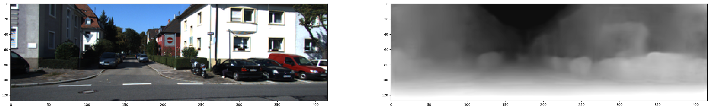

# DeepMatchVO
Implementation of ICRA 2019 paper: [Beyond Photometric Loss for Self-Supervised Ego-Motion Estimation](https://arxiv.org/abs/1902.09103)
```
@inproceedings{shen2019icra,  
  title={Beyond Photometric Loss for Self-Supervised Ego-Motion Estimation},
  author={Shen, Tianwei and Luo, Zixin and Zhou, Lei and Deng, Hanyu and Zhang, Runze and Fang, Tian and Quan, Long},  
  booktitle={International Conference on Robotics and Automation},  
  year={2019},  
  organization={IEEE}  
}
```

# Environment
This codebase is tested on Ubuntu 16.04 with Tensorflow 1.7 and CUDA 9.0.

# Demo
### Download Pre-trained Models
Download the [models](https://drive.google.com/file/d/1xWNm9MclJHD729uS6U6k2Oopn--Vnban/view?usp=sharing) presented in the paper, and then unzip them into the `ckpt` folder under the root.

### Run a Simple Script
After downloading the model, you can run a simple demo to make sure the setup is correct.
```bash
python demo.py
```
The output is shown below


# Generate Train and Test Data
Given that you have already downloaded the [KITTI](http://www.cvlibs.net/datasets/kitti/) odometry and raw datasets, the provided python script `data/prepare_train_data.py` is able to generate the training data with SIFT feature matches. Yet, the feature and match files are in accord with our internal format, which are not publicly available at this point. Alternatively, we suggest first generating the concatenated image triplets by

```bash
# for odometry dataset
python data/prepare_train_data.py --dataset_dir=$kitti_raw_odom --dataset_name=kitti_odom --dump_root=$kitti_odom_match3 --seq_length=3 --img_width=416 --img_height=128 --num_threads=8
```
where `$kitti_raw_odom` and `$kitti_odom_match3` are the input odometry dataset and output files for training. Some example input paths (on my machine) are shown in `command.sh`.

Then download our pre-computed camera/match files from [link](https://drive.google.com/open?id=1ZnLtQqFDqEVghtDjEOVnBlFpyDaJY_Um). Replace the corresponding generated camera files in `$kitti_odom_match3` with the ones you have downloaded. It contains the all the camera intrinsics and the sampled matching information (for each file of an image triplet, the first line is the camera intrinsics, then the next 200 (2*100) lines are the matching coordinates for two image pairs (target image with left source image and target image with right source image)).

# Train
The training is done, e.g. on the KITTI odometry dataset, by using 

```bash
# Train on KITTI odometry dataset
match_num=100
python train.py --dataset_dir=$kitti_odom_match3 --checkpoint_dir=$checkpoint_dir --img_width=416 --img_height=128 --batch_size=4 --seq_length 3 \
    --max_steps 300000 --save_freq 2000 --learning_rate 0.001 --num_scales 1 --init_ckpt_file $checkpoint_dir'model-'$model_idx --continue_train=True --match_num $match_num
```

We suggest training from a pre-trained model, such as the ones we have provided in [models](https://drive.google.com/file/d/1xWNm9MclJHD729uS6U6k2Oopn--Vnban/view?usp=sharing). Also note that do not use the model trained on the KITTI odometry dataset (for pose evaluation) on depth evaluation, nor the model trained on the KITTI Eigen split on pose evaluation. Otherwise, you will get better but biased (train-on-test) results because test samples in one dataset have overlap with the training samples in another.

# Test
To evaluate the depth and pose estimation performance in the paper, use 

```bash
# Testing depth model
r=250000
depth_ckpt_file=$rootfolder$checkpoint_dir'model-'$r
depth_pred_file='output/model-'$r'.npy' 
python test_kitti_depth.py --dataset_dir $kitti_raw_dir --output_dir $output_folder --ckpt_file $depth_ckpt_file #--show
python kitti_eval/eval_depth.py --kitti_dir=$kitti_raw_dir --pred_file $depth_pred_file #--show True --use_interp_depth True
```
You can also use `--show` option to visualize the depth maps.

```bash
# Testing pose model
sl=3
r=258000
pose_ckpt_file=$root_folder$checkpoint_dir'model-'$r
for seq_num in 09 10
do 
    rm -rf $output_folder/$seq_num/
    echo 'seq '$seq_num
    python test_kitti_pose.py --test_seq $seq_num --dataset_dir $kitti_raw_odom --output_dir $output_folder'/'$seq_num'/' --ckpt_file $pose_ckpt_file --seq_length $sl --concat_img_dir $kitti_odom_match3
    python kitti_eval/eval_pose.py --gtruth_dir=$root_folder'kitti_eval/pose_data/ground_truth/seq'$sl'/'$seq_num/  --pred_dir=$output_folder'/'$seq_num'/'
done
```

It outputs the same result in the paper:

| Seq     | ATE mean | std    |
|---------|----------|--------|
| 09      | 0.0089   | 0.0054 |
| 10      | 0.0084   | 0.0071 |

# Contact
Feel free to contact me (Tianwei) if you have any questions, either by email or by issue.

# Acknowledgements
We appreciate the great works/repos along this direction, such as [SfMLearner](https://github.com/tinghuiz/SfMLearner) and [GeoNet](https://github.com/yzcjtr/GeoNet), and also the evaluation tool [evo](https://github.com/MichaelGrupp/evo) for KITTI full sequence evaluation.
